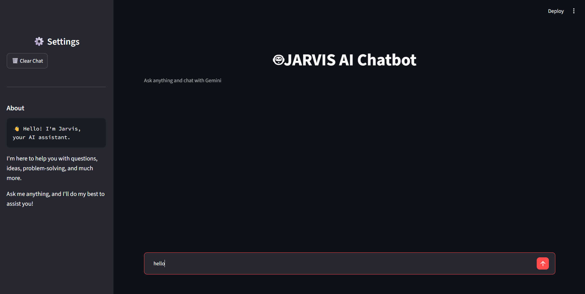
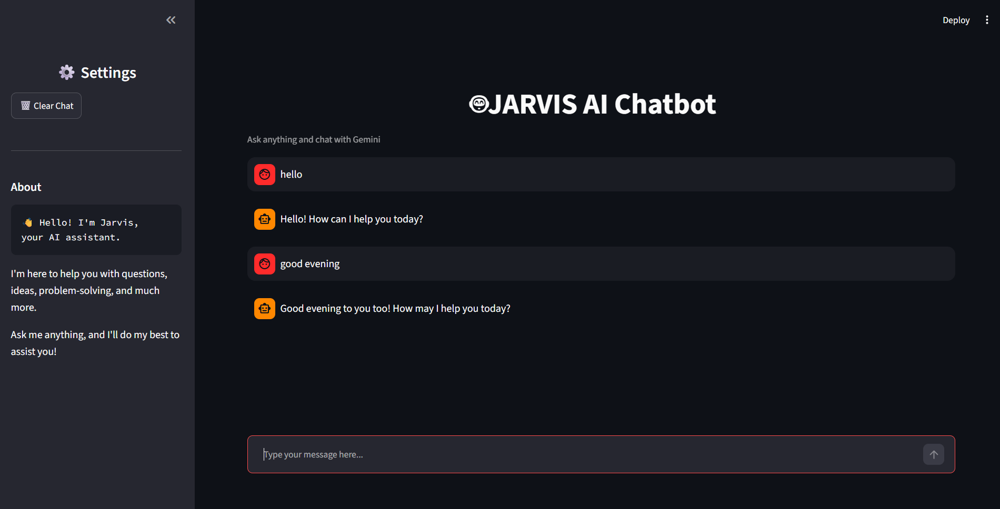
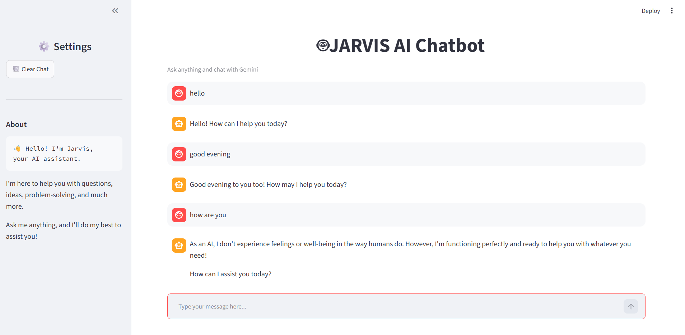

# 🤖 Jarvis AI Chatbot

<p align="center">
  
  
  
  
</p>

A modern AI chatbot powered by **Google Gemini 2.5 Flash** and built using **Python** and **Streamlit**. The chatbot provides intelligent conversations with a clean, responsive, and user-friendly interface.

---

# 📌 Project Overview

Jarvis AI is an intelligent chatbot developed as part of the **DecodeLabs AI Internship**. It leverages Google's Gemini API to generate accurate, context-aware responses while maintaining an elegant Streamlit-based user interface.

---

# ✨ Features

- 🤖 AI-powered conversations using Google Gemini 2.5 Flash
- 💬 Real-time chat interface
- 🧠 Context-aware responses
- 🗑️ Clear chat history option
- 📊 Chat statistics
- 🎨 Modern and responsive UI
- 🔒 Secure API key management using `.env`
- ⚡ Fast response generation
- 📱 Cross-platform support

---

# 🛠️ Tech Stack

| Technology | Purpose |
|------------|---------|
| Python | Backend |
| Streamlit | User Interface |
| Google Gemini API | AI Model |
| python-dotenv | Environment Variable Management |

---

# 📂 Project Structure

```text
decodeabs_task/
│
├── app.py
├── requirements.txt
├── .gitignore
├── .env
│
├── assets/
│   ├── style.css
│   └── logo.png
│
├── screenshots/
│   ├── home.png
│   ├── example1.png
│   └── example2.png
│
├── utils/
│   └── gemini_client.py
│
└── README.md
```

---

# 🚀 Installation

### Clone the Repository

```bash
git clone https://github.com/KunalGautam8788/decodeabs_task.git
```

### Navigate to the Project

```bash
cd decodeabs_task
```

### Install Dependencies

```bash
pip install -r requirements.txt
```

### Create a `.env` File

```env
GEMINI_API_KEY=YOUR_API_KEY
```

### Run the Application

```bash
streamlit run app.py
```

---

# 📸 Project Screenshots

## 🏠 Home Screen



---

## 💬 Chat Example 1



---

## 💬 Chat Example 2



---

# 📈 Future Improvements

- 🎙️ Voice Input
- 🔊 Text-to-Speech
- 🌐 Multi-language Support
- 📂 Chat Export
- 🌙 Dark/Light Theme Toggle
- 📄 PDF Upload & AI Chat
- 🖼️ Image Understanding

---

# 👨‍💻 Developer

**Kunal Gautam**

AI & Python Developer

DecodeLabs AI Internship Project

---

# ⭐ Support

If you found this project useful, consider giving it a **⭐ Star** on GitHub.

It helps others discover the project and motivates future improvements.

---

# 📄 License

This project is developed for educational and internship purposes.

© 2026 Kunal Gautam. All Rights Reserved.